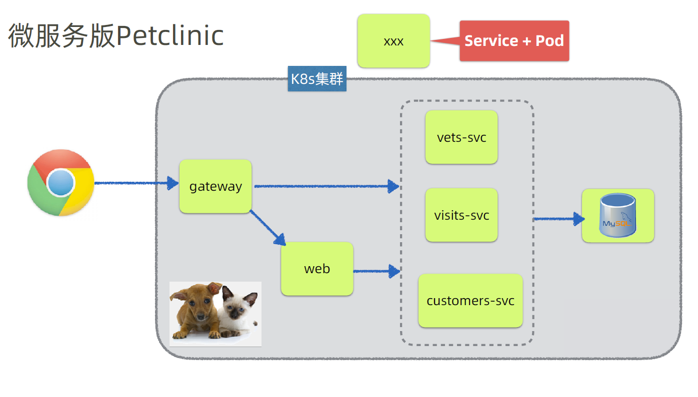
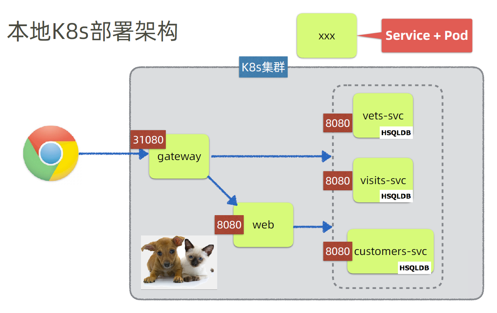

# spring-petclinic-msa

微服务spring-petlinic Kubernetes版



本地镜像构建

```shell
mvn clean install
```

镜像构建+上传dockerhub

```shell
mvn clean deploy
```

**镜像相关配置可以在父pom.xml中进行修改**

# 在本地部署spring-petclinic

```shell
kubectl apply -f k8s/local/.
```

